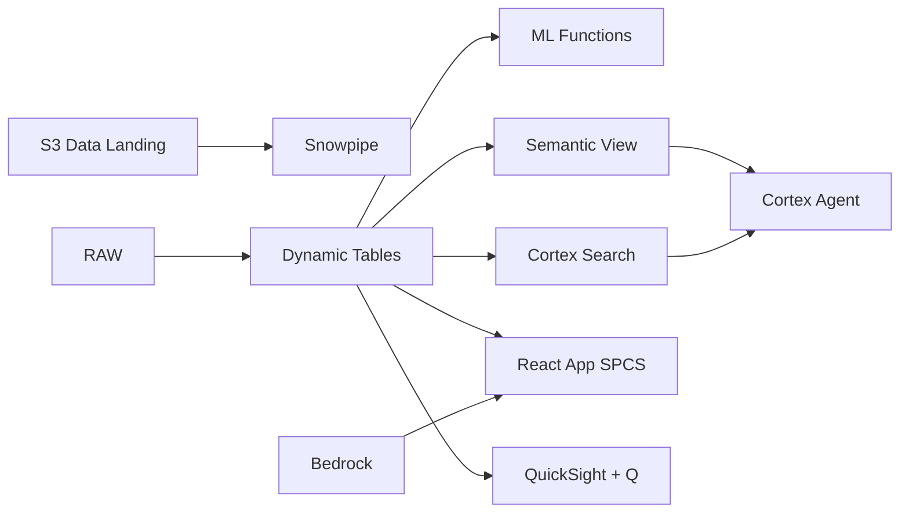

# Semiconductor Supply Chain Visibility

Multi-tier BOM tracking across 50 suppliers for Malaysia's semiconductor corridor — Snowflake Dynamic Tables build real-time supply graphs while Iceberg enables partner access via Athena.

## Architecture

Malaysia's semiconductor corridor relies on 50+ tier-1 suppliers spanning ASEAN and East Asia. A single supplier disruption can cascade through multi-level BOMs, halting production lines within days. With RM 890M in annual procurement and 12-day average lead time deviations, the CSCO needs real-time visibility into supplier risk, not monthly spreadsheet reviews.



## Snowflake Capabilities

| Capability | Implementation |
|-----------|---------------|
| Dynamic Tables | SUPPLIER_RISK_SCORE / BOM_COST_ROLLUP / LEAD_TIME_ANALYTICS / SUPPLY_GRAPH |
| ML Functions | ML.FORECAST + ML.ANOMALY_DETECTION |
| Cortex AI | COMPLETE, AI_CLASSIFY, SUMMARIZE |
| Cortex Search | 60 documents indexed |
| Cortex Agent | SUPPLY_CHAIN_INTELLIGENCE_AGENT |
| Semantic View | SUPPLY_CHAIN_ANALYTICS |
| React App (SPCS) | 5 tabs + DemoGuide |


## AWS Services

| Service | Role in Demo |
|---------|-------------|
| Amazon S3 | Store supplier documents, contracts, and shipment manifests |
| AWS Glue | ETL for BOM hierarchy and supplier data integration |
| Amazon Athena | Partner self-service queries on supply chain data |
| Apache Iceberg (on AWS) | Open table format for cross-platform supply chain analytics |
| Amazon Bedrock (Claude) | Generate supplier risk narratives and mitigation strategies |
| Amazon QuickSight + Q | Procurement dashboard with natural language queries |


## Personas

| Persona | Role | Key Questions |
|---------|------|---------------|
| **Lim Chee Keong** | Chief Supply Chain Officer | "Which suppliers are flagged high risk?" "What's our total procurement spend this quarter?" |
| **Siti Nurhaliza binti Ahmad** | Procurement Manager | "Which POs are overdue by more than 7 days?" "Show me the BOM breakdown for our top-revenue product." |


## Data

| Table | Rows | Description |
|-------|------|-------------|
| SUPPLIERS | 50 | Tier-1 and tier-2 suppliers across ASEAN and East Asia |
| BOM_ITEMS | 2,000 | Multi-level bill of materials with parent-child relationships |
| PURCHASE_ORDERS | 10,000 | 12 months of procurement orders with delivery tracking |
| SHIPMENTS | 5,000 | Inbound shipment tracking with carrier and customs data |
| SUPPLIER_DOCS | 60 | Contracts, quality audits, compliance certificates, risk assessments |
| ASEAN_TRADE | 12 | Regional trade flow and tariff context |


## Build Instructions

### Prerequisites
- Snowflake account with ACCOUNTADMIN access
- Cortex AI enabled (ML Functions, Search, Agent)
- Warehouse: SEMI_WH (Medium)
- AWS CLI with access (us-west-2)

### Deployment

```bash
snowsql -f snowflake/00_setup.sql
snowsql -f snowflake/01_marketplace_install.sql
snowsql -f snowflake/02_raw_tables.sql
snowsql -f snowflake/03_staging.sql
snowsql -f snowflake/04_dynamic_tables.sql
snowsql -f snowflake/05_search.sql
snowsql -f snowflake/06_ml_models.sql
snowsql -f snowflake/07_semantic_view.sql
snowsql -f snowflake/08_agent.sql
```

### React App (SPCS)
```bash
cd app && npm ci && npm run build
docker build -t aws-malaysia-semiconductor-supply-chain-app .
docker push bdiqc8sm-default.registry.snowflakecomputing.com/semiconductor_supply_chain/app/aws_malaysia_semiconductor_supply_chain/app:latest
```

### Demo Mode
Open the app URL with `?demo=true` for presenter view.

## Build Modes

### Snowflake Only
Run scripts 00-08 (skip AWS-specific integration). Uses:
- **Iceberg Tables** instead of Amazon S3
- **Dynamic Tables (declarative SQL)** instead of AWS Glue
- **Iceberg Tables (open format access)** instead of Amazon Athena
- **Iceberg Tables (native Snowflake)** instead of Apache Iceberg (on AWS)
- **Cortex Complete** instead of Amazon Bedrock (Claude)
- **Snowflake Intelligence (Cortex Analyst)** instead of Amazon QuickSight + Q

### Full AWS + Snowflake
Run all scripts including AWS integration. Deploy QuickSight dashboard from `quicksight/`.

## Business Impact

Industry research and Snowflake customer outcomes:
- **Malaysia semiconductor exports reached RM 450B (US$98B) in 2023, representing 18.4% of GDP** — [MIDA](https://www.mida.gov.my/setting-up-in-malaysia/why-malaysia/)
- **Supply chain disruptions cost semiconductor companies 3-5% of annual revenue on average** — [McKinsey Supply Chain](https://www.mckinsey.com/capabilities/operations/our-insights/risk-resilience-and-rebalancing-in-global-value-chains)
- **Companies with advanced supply chain visibility reduce lead time variability by 50%** — [Gartner Supply Chain](https://www.gartner.com/en/supply-chain)
- **Siemens** (Snowflake customer): processes 2+ petabytes of manufacturing data on Snowflake for real-time yield and quality analytics across global fabs -- [snowflake.com/customers/siemens](https://www.snowflake.com/en/customers/all-customers/case-study/siemens-1/)


## Key Demo Numbers

- **50 tier-1 suppliers** tracked across ASEAN and East Asia
- **3 suppliers** flagged HIGH RISK (delivery + financial + concentration)
- **RM 890M** annual procurement spend (US$205M)
- **12-day average** lead time deviation across all suppliers
- **60 supplier docs** indexed and searchable via Cortex Search
- **7 components** single-source dependency (no qualified alternative)


## License

Apache 2.0 — See [LICENSE](LICENSE) for details.

This is a personal demo project and is not an official Snowflake offering. It comes with no support or warranty.